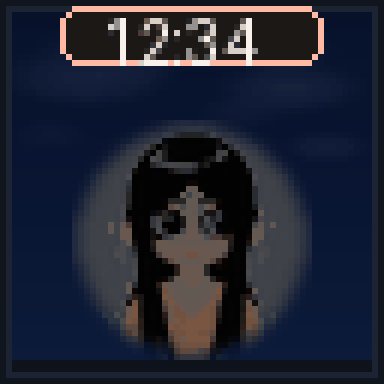
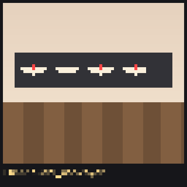

# Godwise 生日时钟

基于 [Clockwise](https://github.com/jnthas/clockwise) 定制的 **64×64 LED 肖像时钟**（生日礼物版）。

手机打开 `http://clockwise.local/poke` 即可逗她。

---

## 人物与场景

日常是人物 + 圆表盘；背景会在白天/黑夜池里轮换。





---

## 眨眼 / 逗她

网页一点，人物眨眼、害羞、比心、瞌睡……


| 按钮 | 效果 |
|------|------|
| 眨眼 / 单眼眨 / 偷看 | 眼睛动画 |
| 害羞 / 比心 / 瞌睡 / 小惊喜 | 表情与特效 |
| 换背景 | 下一张场景 |
| 白天 / 黑夜 / 跟随时间 | 强制或自动昼夜 |
| 显示秒针 | 圆表盘秒针开关 |
| 自动状态 | 一段时间内按间隔自动触发 |

---

## 请出去 → 数字钟 + 沙漏

人物约 **3 秒** 慢慢滑出 → 圆表盘旋转缩小消失 → 背景上的简洁 `HH:MM`；下方沙漏跟着秒走，**每过一分钟换一张背景**。点「请回来」人物再滑回来。


---

## 本机烧录

```bash
cd firmware
set FW_NAME=GodwisePortrait
pio run -e esp32dev -t upload --upload-port COMx
```

依赖见 `firmware/platformio.ini`（含 `huge_app` 分区以装下多场景资源）。

---

Fork from [jnthas/clockwise](https://github.com/jnthas/clockwise) · 本仓库：[r8e8cd8/clockwise](https://github.com/r8e8cd8/clockwise)
